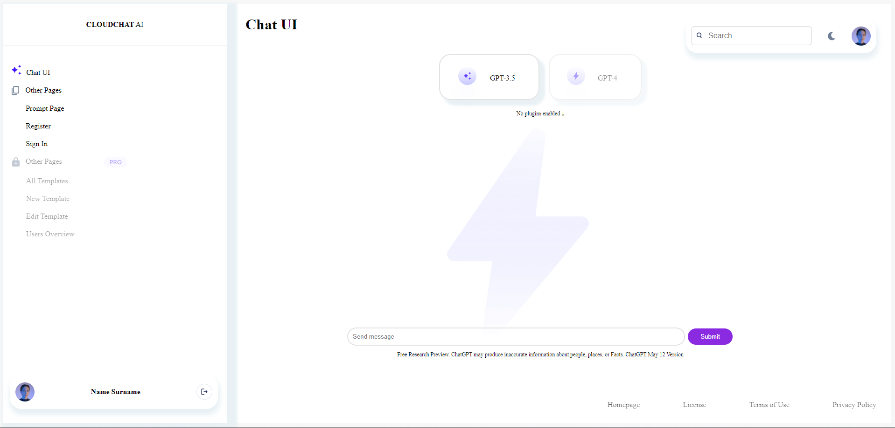

# Building web applications with Svelte

## Prerequisites

- [NODE](https://nodejs.org/en/download/prebuilt-installer/)

# Project Name: Svelte ChatGPT

### Author: Hans-Märten Liiu

 

## Main Idea:

Learn and Use Svelte

## How to boot the application:

- For frontend, with CMD you have to move to frontend folder and first type npm install to install all packages and after that you can type npm run dev -- --open.

 

## Images of the application

- Main View
  
